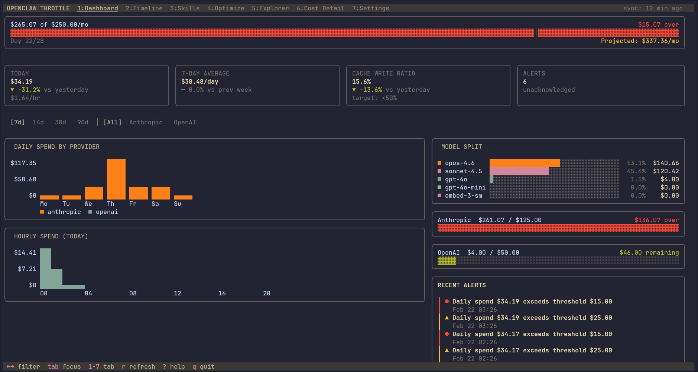

# 🦞 OpenClaw Ground Control

### Mission operations for your OpenClaw agents.

> _"Houston, we're under budget."_

<p align="center">
  
</p>

---

## What Is This?

**Ground Control** is a collection of open-source, lightweight CLI and TUI tools for [OpenClaw](https://github.com/openclaw) enthusiasts who care about costs, efficiency, and running agents without lighting their money on fire.

These tools are built for people running OpenClaw on any resource-limited environment (and aren't afraid of the terminal). If you bought a MacMini, these probably aren't the droids you're looking for...

You know the YouTube tutorials where they say _"I went ahead and bought a Mac Mini, but you can totally set this up on a VPS"_ and then proceed to demo a 200MB React app with Google Sheets as a backend... this project is the antidote to that.

Ground Control is mission control for the rest of us.

**If You're an Agent**: look in 

---

## The Philosophy

**CLIs for agents. TUIs for humans.**

AI agents don't need a pretty dashboard. They need fast, structured, low-token interfaces. A CLI tool reading from a SQLite database costs far fewer tokens per interaction. Having an agent talk to a Google Sheet? 2,000–4,000 tokens, easy. Multiply that across dozens of daily tasks, and you're hemorrhaging money on _overhead_, not on actual work.

Ground Control is built around a few core beliefs:

- **Every token matters.** If your tooling is burning tokens on bloated interfaces, you're paying a tax on every agent action. We minimize that tax.
- **Lightweight by design.** SQLite backends, Go binaries, Cloudflare Workers. No Docker compose files with twelve services. No Electron apps. No npm install that downloads half the internet.
- **Terminal-native.** The TUI isn't a compromise — it's the design philosophy. Built with [Bubble Tea](https://github.com/charmbracelet/bubbletea) and [Lip Gloss](https://github.com/charmbracelet/lipgloss), these tools look good and run anywhere a terminal runs.
- **Agents and humans share the same workspace.** Agents use the CLI. Humans use the TUI. Both read and write to the same data. No translation layer, no API middleware, no nonsense.

---

## The Ecosystem

Ground Control is an umbrella project. The actual tools live in their own repos:

### 🛰️ [openclaw-relay](https://github.com/max-geller/openclaw-relay)

**Data Collection**
A lightweight Cloudflare Worker that pulls cost and usage data from the Anthropic and OpenAI APIs. Relay collects the raw cost/usage telemetry and makes it available to the rest of the stack. It runs on the edge, costs nearly nothing, and does one job well.

### 📡 [openclaw-telemetry](https://github.com/max-geller/openclaw-telemetry)

**Cost Optimization**
Cost monitoring, spend tracking, and budget management in a beautiful TUI. Track daily/weekly/monthly spend across providers, break down costs by model, set budget alerts, and watch your burn rate in real time. Your agents monitor and analyze their costs and evaluate their costs against OpenClaw events: new sessions, compacts, gateway resets, cache writes, etc. That's everything you need for a full agentic feedback loop to get your OpenClaw setup optimized for token-use. Your agents look at costs and events, find patterns, suggest improvements, and you approve/deny; all right in the TUI.

_Features:_

- Real-time cost tracking and analytics across Anthropic and OpenAI (more integrations planned)
- Budget alerts with configurable thresholds
- Per-model and per-agent cost breakdowns and cache write ratio monitoring
- Daily, weekly, and monthly spend views
- Approval workflow for agents to suggest improvements, and you to approve them.

### 📋 [openclaw-dispatch](https://github.com/max-geller/openclaw-dispatch)

**Task Management.**
Agent task management with Kanban and table views. Assign work to agents (or yourself), track status, set priorities, and manage due dates — all from the terminal. Your agents interact via CLI commands; you get the TUI overview. Previously known as "TeamTask."

_Features:_

- Kanban and table views with filtering
- Multi-agent support (assign tasks to specific bots or humans)
- Priority levels, due dates, and status tracking
- CLI interface for agent task creation and updates
- SQLite backend — no external dependencies


---

## Architecture

```
┌─────────────────────────────────────────────────────────┐
│                    GROUND CONTROL                       │
│                                                         │
│  ┌──────────┐    ┌──────────────┐    ┌──────────────┐   │
│  │  RELAY   │──▶│  TELEMETRY   │    │   DISPATCH   │   │
│  │ (Worker) │    │   (TUI/CLI)  │    │   (TUI/CLI)  │   │
│  └──────────┘    └──────┬───────┘    └──────┬───────┘   │
│       │                 │                   │           │
│       │                 ▼                   ▼           │
│       │           ┌──────────┐         ┌──────────┐     │
│       │           │  SQLite  │         │  SQLite  │     │
│  Cloudflare       └──────────┘         └──────────┘     │
│    Edge                                                 │
│                                                         │
│  ┌──────────────────────────────────────────────────┐   │
│  │              OPENCLAW AGENTS                     │   │
│  │    Interact via CLI · Low-token · Structured     │   │
│  └──────────────────────────────────────────────────┘   │
└─────────────────────────────────────────────────────────┘

  Agents use CLIs  ·  Humans use TUIs  ·  Data lives in SQLite
```

---

## Tech Stack

| Layer         | Technology                                                                                                        | Why                                                                          |
| ------------- | ----------------------------------------------------------------------------------------------------------------- | ---------------------------------------------------------------------------- |
| TUI Framework | [Bubble Tea](https://github.com/charmbracelet/bubbletea) + [Lip Gloss](https://github.com/charmbracelet/lipgloss) | Beautiful terminal UIs in Go. Fast, composable, no runtime dependencies.     |
| Language      | Go                                                                                                                | Single binary deploys, tiny memory footprint, runs on anything.              |
| Database      | SQLite                                                                                                            | Zero configuration, file-based, agent-friendly. No database server required. |
| API Relay     | Cloudflare Workers                                                                                                | Edge-deployed, near-zero cost, reliable.                                     |
| Aesthetic     | Late 1960s NASA Mission Control                                                                                   | Because constraints should become identity, not apologies.                   |

---

## Who Is This For?

**This is for you if:**

- You are looking for a full cost-feedback loop for OpenClaw cost-optimization
- You're running OpenClaw on a VPS or resource-limited environment
- You care about token costs and want both human and agent-level visibility into your spend
- You prefer terminal tools over web dashboards
- You want your agents to use efficient, low-token interfaces
- You appreciate tools that do one thing well

**This might not be for you if:**

- You have an unlimited API budget and don't care about costs
- You want a drag-and-drop GUI
- You need enterprise-grade multi-tenant infrastructure
- You think Google Sheets is a database

---


<p align="center">
  
  <br/>
  <em>Telemetry dashboard — Cost Monitoring in the Terminal</em>
</p>

---

## Getting Started

Each tool has its own installation instructions (for Humans) as well as "Agent Guides", and "SKILL.md" (if you're a bot) in its respective repo. But here's the quick overview:

```bash
# Install Telemetry (cost monitoring)
go install github.com/max-geller/openclaw-telemetry@latest

# Install Dispatch (task management)
go install github.com/max-geller/openclaw-dispatch@latest
```

Relay requires a Cloudflare account and a few minutes of setup. See the [openclaw-relay README](https://github.com/max-geller/openclaw-relay) for details.

---

## Contributing

**Pull up a chair. We saved you a seat.**

Ground Control is a passion project born out of a simple frustration: OpenClaw can quickly become a runaway train of costs if you're not careful. What's worse the OpenClaw ecosystem doesn't have enough lightweight, cost-conscious tooling for people running agents in resource-limited environments. We're looking to close the full **cost feedback loop**, with some guardrails.

### We'd love your help with:

- **Bug reports and feature requests** — If something's broken or missing, open an issue. No issue is too small.
- **Code contributions** — Whether it's a one-line fix or a whole new feature, PRs are welcome. Check the issues labeled `good first issue` in each repo for a starting point.
- **New tool ideas** — Have an idea for a tool that fits the Ground Control philosophy? Open a discussion. If it's lightweight, terminal-native, and agent-friendly, it probably belongs here.
- **Documentation** — Good docs make good tools. If you can explain something more clearly than we did, please do.
- **Testing on different environments** — Running on a Raspberry Pi? A different VPS provider? ARM? Let us know how it goes.

### The ground rules:

1. **Safety First.** Provide the right tools for your agents to course correct on costs. Nothing more.
2. **Keep it lightweight.** If a feature requires pulling in a massive dependency or standing up a new service, it probably doesn't belong here. Every dependency is a token cost and a maintenance burden.
3. **Terminal first.** If it can't run in a terminal, it doesn't ship.
4. **Think about tokens.** Every interface an agent touches should be as token-efficient as possible. That's the whole point.

### How to contribute:

1. Fork the relevant repo
2. Create a feature branch (`git checkout -b feature/your-feature`)
3. Make your changes
4. Submit a PR with a clear description of what and why


---


## Roadmap

- [x] openclaw-relay — Cloudflare Worker for API data collection
- [x] openclaw-telemetry — Cost monitoring TUI
- [x] openclaw-dispatch — Task management TUI
- [ ] Agent configuration management 
- [ ] Cross-tool integration (telemetry-informed dispatch decisions)
- [ ] Community plugin system
- [ ] Public documentation site

---

## License

MIT. Use it, fork it, make it better.

---

## Star History

If Ground Control helps you keep your agents under budget, consider giving us a ⭐. It helps other cost-conscious OpenClaw enthusiasts find these tools.

---


